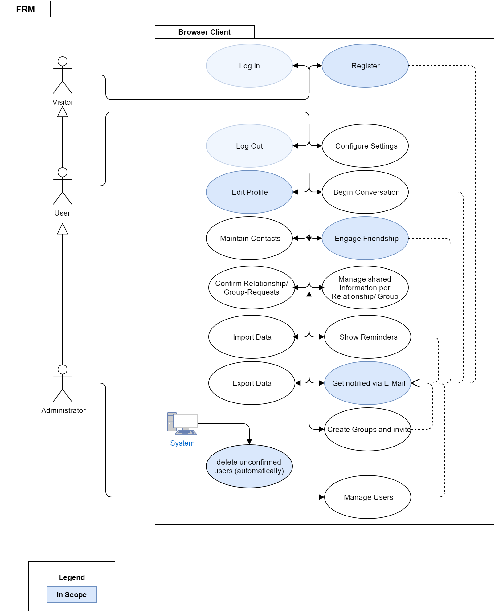

#FRM System
##Software Requirements Specification
### Version 1.1

Table of Contents
============

1\. Introduction

1.1 Purpose

1.2 Scope

1.3 Definitions, Acronyms, and Abbreviations

1.4 References

1.5 Overview

2\. Overall Description

3\. Specific Requirements

3.1 Functionality

3.1.1 Contact Management

3.1.2 Reports and Dashboards

3.1.3 Customizable HomeScreen

3.1.4 Chat integration

3.1.5 API Access

3.1.6 Email Integration

3.2 Usability

3.2.1 Using a browser

3.2.2 Contact Sharing

3.2.3 Setting up an account

3.3 Reliability

3.3.1 App availability

3.3.2 Mean Time Between Failures

3.3.3 Mean Time To Repair

3.3.4 Bugs

3.4 Performance

3.4.1 Capacity

3.4.2 Response time

3.5 Supportability

3.5.1 Language Support

3.5.2 Maintenance

3.6 Design Constraints

3.7 On-line User Documentation and Help System Requirements

3.8 Purchased Components

3.9 Interfaces

3.9.1 User Interfaces

3.9.2 Hardware Interfaces

3.9.3 Software Interfaces

3.9.4 Communications Interfaces

3.10 Licensing Requirements

3.11 Legal, Copyright, and Other Notices

3.12 Applicable Standards

4\. Supporting Information

Introduction
============

Purpose
-------

This SRS describes all specifications for the
“Friend-Relationship-Management System”. The
Friend-Relationship-Management System (FRM) will be an application that
helps users who have many friends to manage their contacts and sensible
contact information. We aim to invent a system that is the
Outlook-Exchange address book for private persons with the maximum
amount of control over your information. In this document the usage of
the "FRM System"-web-application will be explained. Furthermore
reliability, reaction speed and other important characteristics of this
project will be specified. This includes design and architectural
decisions regarding optimization of these criteria as well.

Scope
-----

This software specification applies to the whole "FRM System"
web-application. The application provides all the features business
people already know from their CRM Systems – for example contact
management, reports and dashboards, customizable home screen, chat
integration, API access and email Integration. All of this brought down
to a user-friendly and uncomplicated level with easy access via internet
browsers. The system will be set up in a way, that allows for expansion
onto mobile platforms like Android and iOS with use of an applicable
framework but it will not integrate these features from the beginning
on.

Definitions, Acronyms, and Abbreviations
----------------------------------------

UC Use Case

UCD Use Case Diagram

OUCD Overall Use Case Diagram

SAD Software Architecture Document

RFC Request for Comments

References
----------
| Title  | Date |
| ------------- | ------------- |
| [FRM System Website] (http://frmsystem.de)  | 11/23/2016  |
| [FRM System Blog](http://wordpress.frmsystem.de/)  | 10/24/2016  |

Overview
--------

The following chapters are about our vision and perspective, the
requirements for deploying the software on our side and accessing the
software on the user side, the demands we have, licensing and the
technical realization of this project.

Overall Description
===================

Our goal is to make the application as secure and easy to use as
possible. In a user-ready state we guarantee that all the sensible
information that you store and share with our application is secure. The
FRM System will be a place, where you can safely store addresses, bank
account information, private telephone numbers and other information
that you do not want to put on networks like Facebook but want to share
with certain people.

What you can do once you uploaded your information is requesting certain
information from other users. You can engage in a “friendship” with a
person to e.g. get his address and to share yours. The other person will
then receive an email, notifying him about your request. With one click
on a link the user can share the requested information. Sharing more or
less information than the person requested is of course possible as
well, these settings can be handled all individually. Another useful
feature are groups: To create a group you get everybody’s user name or
email address and add them. When someone accepts the invitation,
everybody in this group can access a certain level of information of
this person. These individual relationships can also be edited
individually on their own to extend the level of information that
someone can view, as long as you are in a group relationship. The system
will offer notifications for birthdays or custom alarms which remind you
that you had no contact with someone for a long time. The system will
also offer a basic messaging feature to make communication easier and
more central if you wish to. If not you can still use services like
Whatsapp and store the preferred way of communication in your profile,
so everybody knows how you can be reached the fastest.

The following picture shows the overall use case diagram for
our software:

Detailed View: 

[Register ](https://github.com/d-wagner/frmsystem/blob/docs/docs/published/UC_Registration.pdf)

[Edit Profile ](https://github.com/d-wagner/frmsystem/blob/docs/docs/published/UC_EditProfile.pdf)  

Specific Requirements 
======================

Functionality
-------------

### Contact Management

  This feature allows you to organize your contacts into groups and into
  any context that you see fit. Within this feature you can set up
  access to information on a contact-to-contact basis and see, who is
  able to access your information.

### Reports and Dashboards

  Users can view statistics in a highly visual, engaging perspective
  using customized reports and dashboards. This is mainly used to see
  upcoming birthdays, the time when you last contacted persons and so
  on, but there will be many possible views to choose from.

### Customizable HomeScreen

  The UI of the application is flexible enough to accommodate the visual
  perspective of everything including the home screen. Layouts can also
  be changed as well as colors based on preferences.

### Chat integration

  You can chat with friends, partners and provide emotional support from
  the UI directly. We also aim to invent groupchats with several
  persons. The ability to message a person is also part of the
  preferences, you can change whether only friends or anyone can message
  you.

### API Access

  Attach your FRM to various services that extend capabilities. In a
  release-ready state of the app you can integrate your contacts
  directly into the contacts app of your android phone, query the system
  for user information and user data etc.

### Email Integration

  Pull in all the features and possibilities of your dedicated email
  client. We aim to integrate a synchronization feature for outlook 
  exchange active sync address books.

Usability 
----------

### Using a browser

  The user of our web application has to know how to open and operate a
  modern browser like Chrome, Firefox or Opera. He is free to use mobile
  versions as well since we will provide a mobile-friendly interface.

### Contact Sharing

  One of the most important features for our user is to share
  information and add new contacts. The needed time for this needs to be
  as short as possible, ideally within the click of a link. The maximum
  needed time to form a request to another user should not exceed the
  time needed, to ask the other person via a social network to reveal
  the needed information (excluding the time to answer, since that is
  not a task for the user in the first place).

### Setting up an account

  The time for this should not exceed the time needed on normal social
  networks, excluding the additional information that our system is able
  to store. The process should be simple and streamlined, it should be
  clear what has to be entered and what does not have to be entered.

Reliability 
------------

### App availability

  Our Service should ensure a 98% up-time. This is mainly depending on
  the ensured up-time by our serverhoster and the time needed to update
  and maintain the site

### Mean Time Between Failures

  3 Months.

### Mean Time To Repair

  The user needs the saved data in his everyday life, therefore a fix
  should not need more than 12 hours in severe cases.

### Bugs

  The system should not contain bugs in critical areas where user data
  is handled or displayed, all data must be safe and bugs in the backend
  processing are not acceptable. Minor UI bugs are tolerable if they get
  fixed within a reasonable amount of time and are not mission-critical
  when it comes to safely handling user data.

Performance
-----------

### Capacity

  A limit of 1000 manageable contacts per user is planned. We plan to
  have a server ready, which can deal with at least 500 user at the
  start of the service without performance issues but plan to upgrade
  this quickly, depending on how frequented the service is

### Response time

  The processing of user data and displaying it should not exceed
  maximum times of 1 second during normal use on average days and 2
  seconds when displaying big amounts of data with many users online at
  the same time.

Supportability
--------------

### Language Support

  We will use following languages, which will be well supported in the
  future:

-   PHP (Laravel)

-   HTML

-   CSS

-   JavaScript

-   MySQL

### Maintenance

  Basic Maintenance access for administrators will be possible with a
  very basic web UI that serves as a utility and should be secure but
  does not need to be pretty. Access to the backend components and
  architecture will only be possible via heavily secured SSH access and
  secure FTP connections.

Design Constraints
------------------

  All information about the architectural design of our application
  stack can be found in our [technology and roles
  blog](http://frm.bplaced.net/wordpress/?p=32) entry, the main part
  being the server running the application

On-line User Documentation and Help System Requirements
-------------------------------------------------------

The whole application is programmed for an intuitive and easy use, so
the user shouldn’t have any problems with controlling it. However,
should there be problems with complicated features in the future, we
will surely implement a help page in the app. We are also going to
implement small tool tips or information texts on the page itself from
the beginning on, to instruct the user what to do with as few words as
possible. Furthermore we document all of the features on our own blog,
on which users can find information and ask us questions.

Purchased Components
--------------------

To deploy the system we are renting a Server4you virtual server. Should
we see the need in the future we can upgrade it to better specifications
with the click of a button.

Interfaces
----------

### User Interfaces

tbd

### Hardware Interfaces

n/a

### Software Interfaces

tbd

### Communications Interfaces

n/a

Licensing Requirements
----------------------

  At the time of writing this we don’t use any code which is subject to
  license requirements except for Open Source such as [Linux
  Debian](https://www.debian.org/legal/licenses/), [Apache License
  2.0](http://www.apache.org/licenses/LICENSE-2.0) and so on.

Legal, Copyright, and Other Notices
-----------------------------------

n/a

Applicable Standards
--------------------

-   HTTP standards for communication client Server

-   HTML and JavaScript / PHP Standards

Supporting Information
======================

